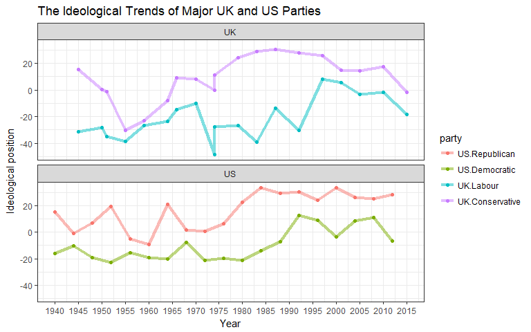

Annotated Code of the Final Project
================

### I finished my project in R rather than in Python.

``` r
# load packages
library(wordcloud)
library(scales)
library(tidytext)
library(manifestoR)
library(tidyverse)
library(lubridate)
library(broom)
library(stringr)
library(reshape2)
library(igraph)
library(ggraph)
library(purrr)
library(widyr)
library(topicmodels)
library(wordVectors)
library(magrittr)
library(Rtsne)
library(tsne)
library(Rtsne)
library(ggrepel)
library(knitr)
```

``` r
# Access information about party and their ideology
mp_setapikey("manifesto_apikey.txt")
mp_main <- mp_maindataset()
```

    ## Connecting to Manifesto Project DB API... 
    ## Connecting to Manifesto Project DB API... corpus version: 2017-2

``` r
corpus <- mp_corpus(party > 0)
```

### Ideology

``` r
# get the ideology
mp_main <- mp_main%>%
  mutate(ideo = mp_scale(.))
```

``` r
# ideology distribution
mp_main %>%
  ggplot(aes(ideo)) + 
  geom_density(fill = "sky blue", color = "black") +
  geom_vline(aes(xintercept = 0), color = "red") +
  labs(title = "General ideology distribution",
       x = "ideology")
```


``` r
# ideology distribution over time
mp_main <- mp_main %>%
  mutate(decade = cut(date, c(0, 196000, 197000, 198000, 199000, 200000, 201000, 202000),
                      labels = c("before1960", "1960s", "1970s", "1980s", "1990s",
                                 "2000s", "2010s")))

ggplot(mp_main, aes(ideo)) + 
  geom_density(fill = "sky blue", color = "black") +
  geom_vline(aes(xintercept = 0), color = "red") +
  facet_wrap(~ decade) +
  theme_bw() +
  labs(title = "Ideology distribution across the world",
       x = "Ideology")
```


``` r
# Ideology in English-speaking countries
mp_eng <- mp_main %>%
  filter(countryname %in% c("New Zealand", "United Kingdom", "United States",
                       "Canada", "Ireland", "Australia"))

mp_eng %>%
  group_by(countryname, decade) %>%
  summarize(a = sum(ideo))
```

    ## # A tibble: 42 x 3
    ## # Groups:   countryname [?]
    ##    countryname     decade        a
    ##          <chr>     <fctr>    <dbl>
    ##  1   Australia before1960  246.800
    ##  2   Australia      1960s   32.700
    ##  3   Australia      1970s  101.200
    ##  4   Australia      1980s  217.300
    ##  5   Australia      1990s  321.544
    ##  6   Australia      2000s   75.098
    ##  7   Australia      2010s   38.481
    ##  8      Canada before1960 -170.100
    ##  9      Canada      1960s -202.500
    ## 10      Canada      1970s  -57.600
    ## # ... with 32 more rows

``` r
mp_eng %>%
  group_by(countryname, decade) %>%
  summarise(ideo = mean(ideo)) %>%
  ggplot(aes(decade, ideo)) +
  geom_col(fill = "skyblue", color = "black") +
  facet_wrap(~ countryname) +
  coord_flip() +
  labs(title = "Ideology in English-Speaking Countries",
       x = "Decade",
       y = "Ideology Score")
```


``` r
# Select the data of 4 parties
mp_UK_US <- mp_main%>%
  filter(party == 61320 | party == 61620 | party == 51320 | party == 51620, 
         edate > as.Date("1940-01-01")) %>%
  select(party, edate, ideo) %>%
  mutate(party = factor(party, levels = c(61620, 61320, 51320, 51620),
                        labels = c( "US.Republican", "US.Democratic", 
                                    "UK.Labour", "UK.Conservative")),
         country = if_else(party %in% c("US.Republican", "US.Democratic"),
                           "US", "UK"))


# Generate a graph to depict ideological trend for 4 parties

ggplot(mp_UK_US, aes(year(edate), ideo, color = party)) + 
  geom_line(size = 1.5, alpha = 0.5) +
  geom_point() +
  theme_bw() +
  facet_wrap(~ country, ncol = 1) +
  scale_x_continuous(breaks = seq(1940, 2020, 5)) +
  labs(title = "The Ideological Trends of Major UK and US Parties",
       x = "Year",
       y = "Ideological position")
```



``` r
# Tidy data
eng <- corpus %>%
  tidy() %>%
  filter(language == "english",
         !party %in% c(72903, 181210, 181310, 181410,
                       181411, 181420, 181910, 31320)) %>%
  mutate(country = cut(party, c(50000, 51952, 53982, 
                                61912, 62952, 63811,64952),
                       labels = c("UK", "Ireland", "US", 
                                  "Canada", "Australia", "New Zealand")))

replace_reg1 <- "https://t.co/[A-Za-z\\d]+|"
replace_reg2 <- "http://[A-Za-z\\d]+|&amp;|&lt;|&gt;|RT|https"
replace_reg <- paste0(replace_reg1, replace_reg2)
unnest_reg <- "([^A-Za-z_\\d#@']|'(?![A-Za-z_\\d#@]))"

tidy_corpus <- eng %>%
  mutate(text = str_replace_all(text, replace_reg, "")) %>%
  unnest_tokens(word, text, token = "regex", pattern = unnest_reg) %>%
  filter(!word %in% stop_words$word,
         str_detect(word, "[a-z]"))
```

``` r
# Word cloud for 4 parties.
eng %>%
  filter(party %in% c(61620, 61320, 51320, 51620)) %>%
  mutate(party = factor(party, levels = c(61620, 61320, 51320, 51620),
                        labels = c( "US.Republican", "US.Democratic", "UK.Labour", "UK.Conservative"))) %>%
  unnest_tokens(word, text) %>%
  anti_join(stop_words) %>%
  count(party, word, sort = TRUE) %>%
  na.omit() %>%
  reshape2::acast(word ~ party, value.var = "n", fill = 0) %>%
  comparison.cloud(max.words = 100, title.size = 1)
```


### Word frequency

``` r
# Frequency caculation and plot
frequency <- tidy_corpus %>%
  group_by(country) %>%
  count(word, sort = TRUE) %>%
  left_join(tidy_corpus %>%
              group_by(country) %>%
              summarise(total = n())) %>%
  mutate(freq = n/total)

frequency1 <- frequency %>%
  filter(country %in% c("UK","US")) %>%
  select(country, word, freq) %>%
  spread(country, freq) %>%
  arrange(UK, US)


ggplot(frequency1, aes(UK, US, color = abs(UK - US))) +
  geom_jitter(alpha = 0.1, size = 2.5, width = 0.25, 
              height = 0.25, show.legend = FALSE) +
  geom_text(aes(label = word), check_overlap = TRUE, 
            vjust = 1.5, show.legend = FALSE) +
  scale_x_log10(labels = percent_format()) +
  scale_y_log10(labels = percent_format()) +
  geom_abline(color = "pink", lty = 2, size = 2) +
  theme_bw()
```


``` r
frequency2 <- frequency %>%
  filter(country %in% c("Canada","US")) %>%
  select(country, word, freq) %>%
  spread(country, freq) %>%
  arrange(Canada, US)

ggplot(frequency2, aes(Canada, US, color = abs(Canada - US))) +
  geom_jitter(alpha = 0.1, size = 2.5, width = 0.25, 
              height = 0.25, show.legend = FALSE) +
  geom_text(aes(label = word), check_overlap = TRUE, 
            vjust = 1.5, show.legend = FALSE) +
  scale_x_log10(labels = percent_format()) +
  scale_y_log10(labels = percent_format()) +
  geom_abline(color = "pink", lty = 2, size = 2) +
  theme_bw()
```


``` r
# clean and tidy title words
tidy_title <- eng %>%
  mutate(text = str_replace_all(text, replace_reg, "")) %>%
  unnest_tokens(word, title, token = "regex", pattern = unnest_reg) %>% 
  filter(!word %in% stop_words$word,
         str_detect(word, "[a-z]"),
         word != 'platform')
```

``` r
# count the word
title_words <- tidy_title %>%
  group_by(country) %>%
  count(word, sort = TRUE)

title_words_c <- title_words %>%
  group_by(country) %>%
  summarise(total = sum(n))

title_words <- left_join(title_words, title_words_c) %>%
  mutate(frequency = n / total)
# plot
title_words %>%
  arrange(desc(frequency)) %>%
  group_by(country) %>%
  mutate(top = seq_along(word)) %>%
  filter(top <= 10) %>%
  ggplot(aes(-top, frequency, fill = country)) +
  geom_col(show.legend = FALSE) +
  geom_text(aes(label = word, y = frequency + 0.08), hjust = "right", size = 4) +
  facet_wrap(~ country, ncol = 3) +
  coord_flip() +
  theme_bw() +
  labs(title = "Most frequent words in manifesto title",
       x = NULL,
       y = "Word Frequency") +
  theme(axis.text.x = element_text(angle = 45, hjust = 1),
        axis.ticks.y = element_blank(),
        axis.text.y = element_blank())
```


``` r
corpus_title <- eng %>%
  unnest_tokens(word, title) %>%
  anti_join(stop_words)


title_word_pairs <- corpus_title %>%
  pairwise_count(word, manifesto_id, sort = TRUE, upper = FALSE)

set.seed(1234)
title_word_pairs %>%
  filter(n >= 5) %>%
  graph_from_data_frame() %>%
  ggraph(layout = "fr") +
  geom_edge_link(aes(edge_alpha = n, edge_width = n), edge_colour = "cyan4") +
  geom_node_point(size = 5) +
  geom_node_text(aes(label = name), repel = TRUE,
                 point.padding = unit(0.2, "lines")) +
  theme_void()
```


### Modeling frequency change

``` r
# Prepare the variable about time
words_by_time <- tidy_corpus %>%
  mutate(day = "01") %>%
  separate(date, into = c('year', 'month'), sep = 4) %>%
  unite(d, year, month, sep = "-") %>%
  unite(date, d, day, sep = "-") %>%
  mutate(date = ymd(date),
         time_floor = floor_date(date, unit = "10 year")) %>%
  count(time_floor, country, word) %>%
  ungroup() %>%
  group_by(country, time_floor) %>%
  mutate(time_total = sum(n)) %>%
  group_by(word) %>%
  mutate(word_total = sum(n)) %>%
  ungroup() %>%
  rename(count = n) %>%
  filter(word_total > 30)
```

``` r
# Build the model for word frequency change caculation
nested_data <- words_by_time %>%
  nest(-word, -country)

nested_models <- nested_data %>%
  mutate(models = map(data, ~ glm(cbind(count, time_total) ~ time_floor,.,
                                  family = "binomial")))


slopes <- nested_models %>%
  unnest(map(models, tidy)) %>%
  filter(term == "time_floor") %>%
  mutate(adjusted.p.value = p.adjust(p.value))
```

``` r
# plot
top_slopes <- slopes %>%
  filter(adjusted.p.value < 0.001) %>%
  select(-statistic, -p.value)

words_by_time %>%
  inner_join(top_slopes, by = c("word", "country")) %>%
  filter(country == "US") %>%
  arrange(desc(abs(estimate))) %>%
  filter(word %in% c(unique(word)[1:10])) %>%
  ggplot(aes(time_floor, count/time_total, color = word, lty = word)) +
  geom_line(size = 1.3) +
  theme_bw() +
  labs(x = NULL, y = "Word frequency",
       title = "Word frequency change (US)") +
  theme(legend.position = "bottom")
```


``` r
top_slope1 <- slopes %>%
  filter(adjusted.p.value < 0.001) %>%
  select(-statistic, -p.value)

words_by_time %>%
  inner_join(top_slope1, by = c("word", "country")) %>%
  filter(country == "UK") %>%
  arrange(desc(abs(estimate))) %>%
  filter(word %in% c(unique(word)[1:11]),
         word != 'ii') %>%
  ggplot(aes(time_floor, count/time_total, color = word, lty = word)) +
  geom_line(size = 1.3) +
  theme_bw() +
  labs(x = NULL, y = "Word frequency",
       title = "Word frequency change (UK)") +
  theme(legend.position = "bottom")
```


``` r
top_slope2 <- slopes %>%
  filter(adjusted.p.value < 0.001) %>%
  select(-statistic, -p.value)

words_by_time %>%
  inner_join(top_slope2, by = c("word", "country")) %>%
  filter(country == "Australia") %>%
  arrange(desc(abs(estimate))) %>%
  filter(word %in% c(unique(word)[1:10])) %>%
  ggplot(aes(time_floor, count/time_total, color = word, lty = word)) +
  geom_line(size = 1.3) +
  theme_bw() +
  labs(x = NULL, y = "Word frequency",
       title = "Word frequency change (Australia)") +
  theme(legend.position = "bottom")
```


``` r
top_slope3 <- slopes %>%
  filter(adjusted.p.value < 0.001) %>%
  select(-statistic, -p.value)

words_by_time %>%
  inner_join(top_slope3, by = c("word", "country")) %>%
  filter(country == "Canada") %>%
  arrange(desc(abs(estimate))) %>%
  filter(word %in% c(unique(word)[1:10])) %>%
  ggplot(aes(time_floor, count/time_total, color = word, lty = word)) +
  geom_line(size = 1.3) +
  theme_bw() +
  labs(x = NULL, y = "Word frequency",
       title = "Word frequency change (Canada)") +
  theme(legend.position = "bottom")
```


``` r
top_slope4 <- slopes %>%
  filter(adjusted.p.value < 0.001) %>%
  select(-statistic, -p.value)

words_by_time %>%
  inner_join(top_slope4, by = c("word", "country")) %>%
  filter(country == "Australia") %>%
  arrange(desc(abs(estimate))) %>%
  filter(word %in% c(unique(word)[1:10])) %>%
  ggplot(aes(time_floor, count/time_total, color = word, lty = word)) +
  geom_line(size = 1.3) +
  theme_bw() +
  labs(x = NULL, y = "Word frequency",
       title = "Word frequency change (Australia)") +
  theme(legend.position = "bottom")
```


### Sentiment analysis

``` r
#Trend 
tidy_corpus %>%
  inner_join(get_sentiments("afinn")) %>%
  separate(date, into = c("year", "month"), sep = 4) %>%
  group_by(country, year) %>%
  summarize(score = sum(score)) %>%
  ggplot(aes(as.numeric(year), score, color = country)) +
  geom_line(show.legend = FALSE, size = 2, alpha = 0.5) +
  geom_point(size = 1.5, show.legend = FALSE) +
  facet_wrap(~ country) +
  theme_bw() +
  labs(title = "Sentiment Trend",
       x = "Year",
       y = "Sentiment Scores")
```


``` r
# all 6 countries
set.seed(8)
tidy_corpus %>%
  inner_join(get_sentiments("bing")) %>%
  count(word, sentiment, sort = TRUE) %>%
  acast(word ~ sentiment, value.var = "n", fill = 0) %>%
  comparison.cloud(max.words = 99, title.size = 2)
```


``` r
# US
tidy_corpus %>%
  filter(country == "US") %>%
  inner_join(get_sentiments("bing")) %>%
  count(word, sentiment, sort = TRUE) %>%
  acast(word ~ sentiment, value.var = "n", fill = 0) %>%
  comparison.cloud(max.words = 99, title.size = 2)
```


``` r
# Functions for bigram words network
count_bigrams <- function(dataset) {
  dataset %>%
    unnest_tokens(bigram, text, token = "ngrams", n = 2) %>%
    separate(bigram, c("word1", "word2"), sep = " ") %>%
    filter(!word1 %in% stop_words$word,
           !word2 %in% stop_words$word) %>%
    count(word1, word2, sort = TRUE)
}


visualize_bigrams <- function(bigrams) {
  set.seed(2016)
  a <- grid::arrow(type = "closed", length = unit(.15, "inches"))
  
  bigrams %>%
    graph_from_data_frame() %>%
    ggraph(layout = "fr") +
    geom_edge_link(aes(edge_alpha = n), show.legend = FALSE, arrow = a) +
    geom_node_point(color = "lightblue", size = 5) +
    geom_node_text(aes(label = name), vjust = 1, hjust = 1) +
    theme_void()
}
```

``` r
eng_bigrams <- eng %>%
  count_bigrams()
```

``` r
# network for all 6 countries
eng_bigrams %>%
  filter(n > 450,
         !str_detect(word1, "\\d"),
         !str_detect(word2, "\\d")) %>%
  visualize_bigrams()
```


``` r
# Network for US
eng_bigrams <- eng %>%
  filter(country == 'US') %>%
  count_bigrams()

eng_bigrams %>%
  filter(n > 80,
         !str_detect(word1, "\\d"),
         !str_detect(word2, "\\d")) %>%
  visualize_bigrams()
```


### Correlation between countries

``` r
# tidy data
cleaned_text <- eng %>%
  filter(str_detect(text, "^[^>]+[A-Za-z\\d]") | text == "",
         !str_detect(text, "writes(:|\\.\\.\\.)$"),
         !str_detect(text, "^In article <"))

usenet_words <- cleaned_text %>%
  unnest_tokens(word, text) %>%
  filter(str_detect(word, "[a-z']$"),
         !word %in% stop_words$word)


words_by_country <- usenet_words %>%
  count(country, word, sort = TRUE) %>%
  ungroup()

# Calculate the correlation
corpus_cors <- words_by_country %>%
  pairwise_cor(country, word, n, sort = TRUE)

# plot
set.seed(2017)
corpus_cors %>%
  graph_from_data_frame() %>%
  ggraph(layout = "fr") +
  geom_edge_link(aes(alpha = correlation, width = correlation),
                 edge_colour = "cyan4") +
  geom_node_point(size = 6, color = "pink") +
  geom_node_text(aes(label = name), repel = TRUE) +
  theme_void()
```


### Word embedding with cluster

``` r
model_US = read.vectors("US_mp.bin")
model_AU = read.vectors("AU_mp.bin")
model_CA = read.vectors("CA_mp.bin")
```

``` r
# function for w2v plot
w2v_plot <- function(model, word, ref_name, country) {

        # Identify the nearest 10 words to the average vector of search terms
        similarity <- nearest_to(model, model[[word]])
        sim <- kable(similarity, caption = paste(country, "word embedding:", ref_name))

        # Identify the nearest 500 words to the average vector of search terms and
        main <- nearest_to(model, model[[word]], 150)
        wordlist <- names(main)

        # Create a subset vector space model
        new_model <- model[[wordlist, average = F]]

        # Run Rtsne to reduce new Word Embedding Model to 2D (Barnes-Hut)
        reduction <- Rtsne(as.matrix(new_model), dims = 2, initial_dims = 50,
                           perplexity = 30, theta = 0.5, check_duplicates = F,
                           pca = F, max_iter = 1000, verbose = F,
                           is_distance = F, Y_init = NULL)

        # Extract Y (positions for plot) as a dataframe and add row names
        df <- as.data.frame(reduction$Y)
        rows <- rownames(new_model)
        rownames(df) <- rows

        # Create t-SNE plot and save as jpeg
        g <- ggplot(df) +
                geom_point(aes(x = V1, y = V2), color = "red") +
                geom_text_repel(aes(x = V1, y = V2, label = rownames(df))) +
                xlab("Dimension 1") +
                ylab("Dimension 2 ") +
                # geom_text(fontface = 2, alpha = .8) +
                theme_bw(base_size = 12) +
                theme(legend.position = "none") +
                ggtitle(paste0("t_SNE Word Embedding Model ", ref_name, ", ", country))

        
        return(list(sim, g))

}
```

``` r
w2v_plot(model_US, "discrimination", "discrimination", "US")
```

    ## [[1]]
    ## 
    ## 
    ## Table: US word embedding: discrimination
    ## 
    ## ---------------  ----------
    ## discrimination    0.0000000
    ## gender            0.2335309
    ## sex               0.2779338
    ## creed             0.2792659
    ## ethnicity         0.2890806
    ## origin            0.2972397
    ## orientation       0.3013289
    ## color             0.3364626
    ## preferential      0.3525866
    ## race              0.3679832
    ## ---------------  ----------
    ## 
    ## [[2]]


``` r
w2v_plot(model_AU, "discrimination", "discrimination", "Australia")
```

    ## [[1]]
    ## 
    ## 
    ## Table: Australia word embedding: discrimination
    ## 
    ## ---------------  ----------
    ## discrimination    0.0000000
    ## sex               0.2665487
    ## grounds           0.3184824
    ## religion          0.3513825
    ## gay               0.3663742
    ## lesbian           0.3883517
    ## race              0.3963921
    ## intersex          0.4078518
    ## racial            0.4098097
    ## nationality       0.4123611
    ## ---------------  ----------
    ## 
    ## [[2]]


``` r
w2v_plot(model_CA, "discrimination", "discrimination", "Canada")
```

    ## [[1]]
    ## 
    ## 
    ## Table: Canada word embedding: discrimination
    ## 
    ## ---------------  ----------
    ## discrimination    0.0000000
    ## religion          0.2913654
    ## workplace         0.2929709
    ## visible           0.3015279
    ## gender            0.3235756
    ## orientation       0.3307412
    ## origin            0.3554414
    ## minorities        0.3822594
    ## equality          0.3939802
    ## colour            0.3979302
    ## ---------------  ----------
    ## 
    ## [[2]]


``` r
# embed word
society = closest_to(model_US,model_US[[c("equality","justice","discrimination",
                                          "society", "injustice", "inequality", "crime")]],50)
society_1 = model_US[[society$word,average=F]]
plot(society_1,method="pca")
```


``` r
# embed word and them cluster them

centers = 150
clustering = kmeans(model_US,centers=centers,iter.max = 40)

society_2 = c("equality","justice","discrimination",
              "society", "injustice", "inequality", "crime")
term_set = lapply(society_2, 
       function(society_2) {
          nearest_words = model_US %>% closest_to(model_US[[society_2]],5)
          nearest_words$word
        }) %>% unlist

subset = model_US[[term_set,average=F]]

subset %>%
  cosineDist(subset) %>% 
  as.dist %>%
  hclust %>%
  plot(main = "US")
```


``` r
# embed word and them cluster them

centers = 150
clustering = kmeans(model_AU,centers=centers,iter.max = 40)

society_2 = c("equality","justice","discrimination",
              "society", "injustice", "inequality", "crime")
term_set = lapply(society_2, 
       function(society_2) {
          nearest_words = model_AU %>% closest_to(model_AU[[society_2]],5)
          nearest_words$word
        }) %>% unlist

subset = model_AU[[term_set,average=F]]

subset %>%
  cosineDist(subset) %>% 
  as.dist %>%
  hclust %>%
  plot(main = "Australia")
```


``` r
# embed word and them cluster them

centers = 150
clustering = kmeans(model_CA,centers=centers,iter.max = 40)

society_2 = c("equality","justice","discrimination",
              "society", "injustice", "inequality", "crime")
term_set = lapply(society_2, 
       function(society_2) {
          nearest_words = model_CA %>% closest_to(model_CA[[society_2]],5)
          nearest_words$word
        }) %>% unlist

subset = model_CA[[term_set,average=F]]

subset %>%
  cosineDist(subset) %>% 
  as.dist %>%
  hclust %>%
  plot(main = "Canada")
```


